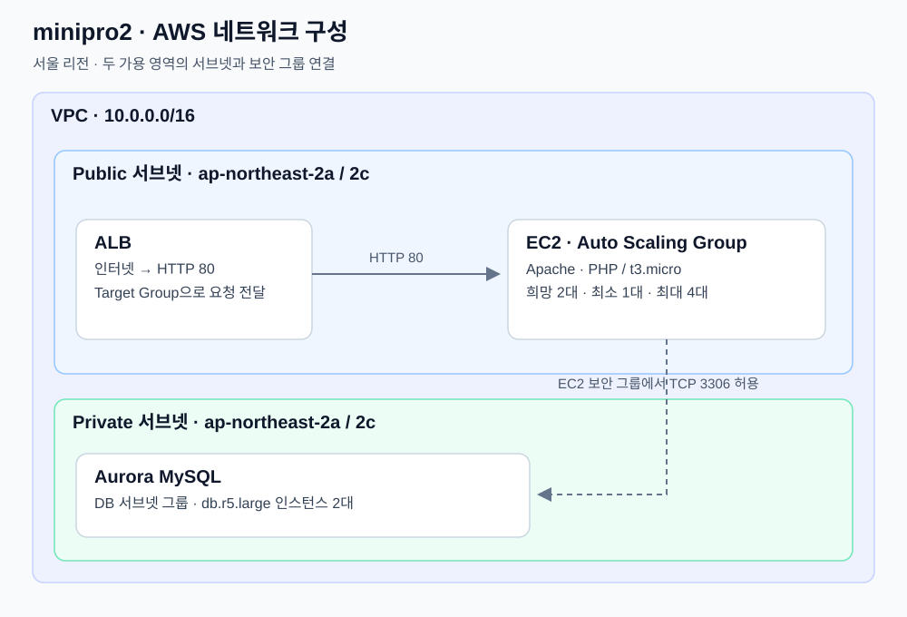

# Terraform · AWS 인프라 구성 실습

**EC2 단일 서버에서 ALB·Auto Scaling·Aurora 구성까지 확장하며, Terraform의 리소스 참조·상태 분리·모듈화를 다루는 예제 저장소입니다.** 일부 예제는 *Terraform: Up & Running*을 출처로 합니다.

ALB(Application Load Balancer)는 웹 요청을 분산하고, ASG(Auto Scaling Group)는 EC2 인스턴스 수를 관리합니다. AZ(Availability Zone)는 리전 안의 가용 영역을 뜻합니다.

대표 구성은 [`minipro2`](minipro2/README.md)입니다. VPC·보안 그룹·ALB·RDS·EC2를 다섯 모듈로 나누고, 각 모듈의 출력을 다음 모듈의 입력으로 연결합니다. 웹 페이지에는 생성된 DB endpoint와 port를 표시합니다.



## 핵심 내용

| 주제 | 코드에서 볼 수 있는 내용 | 시작점 |
|---|---|---|
| 모듈 간 연결 | 서브넷·보안 그룹 ID, Target Group ARN, DB endpoint를 모듈 출력으로 전달 | [minipro2/dev/main.tf](minipro2/dev/main.tf) |
| 계층별 접근 제어 | 인터넷 → ALB 80, ALB SG → EC2 80, EC2 SG → DB 3306 허용 | [minipro2/modules/sg](minipro2/modules/sg/main.tf) |
| 서버 초기화 | AMI 조회, Launch Template, 템플릿으로 user data 생성, ASG에 Target Group 연결 | [minipro2/modules/ec2](minipro2/modules/ec2/main.tf) |
| 상태 분리 | S3에 저장한 DB state의 출력을 웹 서버 구성에서 참조 | [03/elb-web-db](03/elb-web-db/stage/services/webserver-cluster/main.tf) |
| 반복·조건·환경 분리 | IAM 사용자 반복 생성, 조건부 정책 연결, stage/prod 모듈 호출 | [05/loop-cond](05/loop-cond/README.md) |

## 저장소 구조

```text
.
├── 02/                 # EC2, VPC, NAT Gateway, ALB·ASG 기초 실습
├── 03/                 # S3 원격 상태, DB 출력 참조, ALB 구성
├── 04/vpc-create/      # VPC·EC2 모듈 입출력 실습
├── 05/
│   ├── loop-cond/      # 반복·조건, IAM, stage/prod 예제
│   ├── simple-condition/
│   └── variable-loop-datasource/
├── minipro1/           # VPC·EC2·Docker·로컬 SSH 설정
├── minipro2/
│   ├── dev/            # 다섯 모듈을 조합하는 실행 디렉토리
│   └── modules/        # vpc · sg · alb · rds · ec2
└── docs/examples.md    # 실습 경로, 실행 전제, 버전·호환성
```

## 대표 구성 · minipro2

| 영역 | 구성 |
|---|---|
| 리전·네트워크 | 서울 `ap-northeast-2`, VPC `10.0.0.0/16`, 2개 AZ의 public/private 서브넷 |
| 요청 수신 | Public 서브넷의 ALB, HTTP 80 리스너와 Target Group |
| 웹 서버 | Public 서브넷의 ASG, 기본 희망 수 2·최소 1·최대 4, `t3.micro` |
| 데이터베이스 | Private 서브넷 그룹의 Aurora MySQL 클러스터, `db.r5.large` 인스턴스 2개 |
| 초기화 결과 | Apache·PHP 설치, DB endpoint·port를 담은 웹 페이지 생성 |

[구성·실행·확인 가이드](minipro2/README.md)에서 모듈 의존 관계와 실제 입력값을 확인할 수 있습니다.

## 시작하기

각 실습 디렉토리가 별도 Terraform 실행 단위입니다. 먼저 AWS 리소스를 만들지 않는 문자열 조건식 예제로 CLI 흐름을 확인할 수 있습니다.

```bash
git clone https://github.com/tjung03/terraform.git
cd terraform/05/simple-condition
terraform init
terraform validate
terraform plan -var='name=Terraform'
```

출력 계획의 `if_else_directive`에서 `Hello, Terraform`을 확인합니다. AWS 구성은 [minipro1](minipro1/README.md) 또는 [minipro2](minipro2/README.md)의 실행 전제와 `plan`부터 확인합니다. `apply`는 실제 유료 리소스를 생성합니다.

## 사용 기술과 호환성

| 항목 | 저장소 구성 |
|---|---|
| 언어·Provider | HCL, `hashicorp/aws` |
| EC2 구성 | Launch Template 사용: `02/webserver-cluster`, `03/elb-web-db`, `minipro2` |
| 서버 이미지 | `minipro1`·`minipro2`는 Amazon Linux 2023 AMI를 이름 조건으로 조회 |
| 원격 상태 | `03`의 S3 backend와 `use_lockfile = true` |
| 예제 버전 제약 | `05/loop-cond`의 다수 예제는 Terraform `>= 1.0.0, < 2.0.0`, AWS Provider `~> 4.0` |

기초 예제에는 Launch Configuration과 Amazon Linux 2를 사용하는 코드도 있습니다. 이 저장소의 Launch Template·Amazon Linux 2023 구성과 함께 [버전·호환성 안내](docs/examples.md#버전과-호환성)에 정리했습니다.

## 예제 출처

`05/loop-cond`의 일부 예제는 *Terraform: Up & Running* Chapter 5를 출처로 명시합니다. 해당 예제의 사용 조건과 적용 범위는 각 디렉터리의 문서에서 확인합니다.
